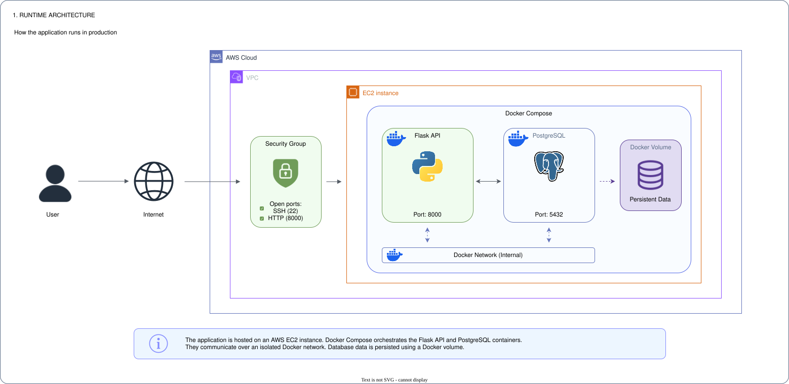
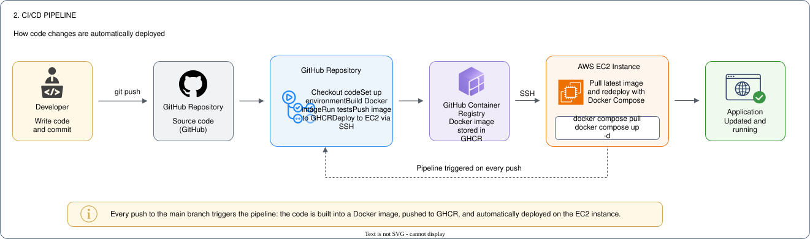

# Cloud Automation Lab

Cloud Automation Lab is a personal project whose goal is to deploy a Flask API and its PostgreSQL database on AWS using modern DevOps and Cloud practices.

The application is containerized with Docker Compose, the infrastructure is provisioned with Terraform, and the deployment is fully automated through a GitHub Actions CI/CD pipeline. Each push triggers the build of a Docker image, its publication to GitHub Container Registry (GHCR), and its automatic deployment to an EC2 instance.

Beyond simply deploying an application, this project serves as a hands-on learning platform to develop practical skills in Infrastructure as Code, containerization, CI/CD, cloud infrastructure, and orchestration technologies such as Docker, Terraform, AWS, GitHub Actions and Kubernetes.

This repository is continuously evolving and will progressively integrate additional components such as monitoring, load balancing, Kubernetes orchestration and other production-oriented cloud practices.

> ⚠️ This repository is actively developed and continuously improved as part of my Cloud / DevOps learning journey.


## Architecture

### Runtime Architecture



The application is hosted on an AWS EC2 instance. Docker Compose orchestrates the Flask API and PostgreSQL containers, which communicate over an isolated Docker network. Database data is persisted using a Docker volume.

### CI/CD Pipeline



Each push to the main branch automatically triggers the deployment pipeline. GitHub Actions builds the Docker image, publishes it to GitHub Container Registry (GHCR), then connects to the EC2 instance via SSH to pull the latest image and restart the application using Docker Compose.


## Technologies

| Category | Technologies |
|----------|--------------|
| Programming | Python, Flask |
| Database | PostgreSQL |
| Containerization | Docker, Docker Compose |
| Infrastructure as Code | Terraform |
| Cloud | AWS (EC2, VPC, Security Groups) |
| CI/CD | GitHub Actions, GitHub Container Registry (GHCR) |
| Version Control | Git, GitHub |


## Project Structure

```text
cloud-automation-lab/
├── .github/
│   └── workflows/
│       └── deploy.yml
├── app/
│   ├── app.py
│   ├── Dockerfile
│   └── requirements.txt
├── docs/
│   ├── runtime-architecture.drawio
│   ├── runtime-architecture.svg
│   ├── cicd-pipeline.drawio
│   └── cicd-pipeline.svg
├── terraform/
│   ├── compute.tf
│   ├── network.tf
│   ├── outputs.tf
│   ├── providers.tf
│   ├── security.tf
│   ├── variables.tf
│   ├── versions.tf
│   ├── terraform.tfvars.example
│   └── scripts/
│       └── install-docker.sh
├── .env.example
├── .gitignore
├── docker-compose.yml
├── docker-compose.prod.yml
└── README.md
```


## Getting Started

### Prerequisites

Before running the project, make sure you have the following installed:

- Git
- Docker
- Docker Compose
- Terraform
- An AWS account (for cloud deployment)

### Clone the repository

```bash
git clone https://github.com/mathurin-maus/cloud-automation-lab.git
cd cloud-automation-lab
```

### Configure environment variables

Create your local environment file from the provided template:

```bash
cp .env.example .env
```

Update the environment variables if necessary.

### Run locally

Start the application using Docker Compose:

```bash
docker compose up --build
```

The API will be available at:

```text
http://localhost:8000
```

You can verify that everything is working correctly by accessing:

```text
http://localhost:8000/health
```

### Deploy to AWS

The AWS infrastructure is provisioned using Terraform:

```bash
cd terraform
terraform init
terraform plan
terraform apply
```

> **Note:** Additional deployment instructions and configuration details will be added as the project evolves.


## Health Endpoint

The application exposes a health endpoint to verify that the API is running and that the PostgreSQL database is reachable.

| Endpoint | Description |
|----------|-------------|
| `/health` | Returns `200 OK` if the application and the database are operational. |

Example:

```text
GET /health

Database OK, Hello from GitHub Actions
```


## Roadmap

- [x] Docker containerization
- [x] Docker Compose orchestration
- [x] Terraform infrastructure provisioning
- [x] AWS EC2 deployment
- [x] GitHub Actions CI/CD pipeline
- [ ] Monitoring (Prometheus & Grafana)
- [ ] Load Balancer
- [ ] Kubernetes deployment
- [ ] Infrastructure hardening